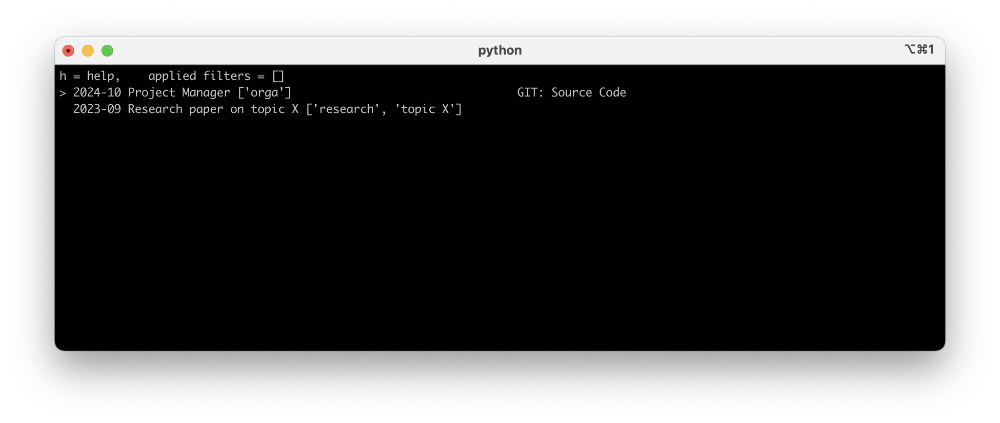

# ProjectManager

A simple project manager for resources like GIT, SVN, LINKS, etc.



## Installation

The manager requires python 3.11+.

You can install the project using pip:

```
pip install git+https://github.com/marioguenzel/ProjectManager.git
```

It can then be used as python module, i.e., 
```
python -m project-manager [-h] [-i] [-a TYPE ACTION] LOCATION
```

## First Steps

### 1 Initialize 

If you want to start the project manager, go to an empty folder and use:
```
python -m project-manager --init .
```
This will initialize a new environment for the project manager.
Especially, you can find files `projects.yaml` and `actions.py` to specify your own projects and actions. (You can find more information on that below.)
A few projects and actions are already predefined.

### 2 Using the manager

Go to the folder where an environment for the project manager is initialized and type 
```
python -m project-manager .
```
This will display your projects and corresponding resources.
- Use `f` to filter for tags. (`tab` can be used to see suggestions from already defined tags.)
- If a resource is chosen, use `right` or `enter` to choose the standard action (first action in actions-list defined in `actions.py`). Otherwise, use `a` to choose from available actions. (Again, use `tab` to see suggestions.)
- For more commands see the help with `h`.


## Add Your Own Projects

If the environment for the project manager is initialized, you can see the `projects.yaml` file inside the folder. 
There, you can specify your own resources. 
Be sure to not give two projects (or two resources of the same project) the same name, as this would mess with internal structures and the pathname conventions.

Each project can be assigned a set of `tags` and a set of `resources`.
Each resource must have a `type` defined. 
The ordering of the projects when running the project manager is the same as in the `projects.yaml` file.
The standard actions support the following file types:

### GIT
```
Resource name:
    type: GIT
    source: <Link>
```

### SVN
```
Resource name:
    type: SVN
    source: <Link>
```

### LINK
```
Resource name:
    type: LINK
    source: <Link>
```

This is especially useful, if you want to add the published paper or platform links for collaboration like Notes, Overleaf links, etc. 

### ELEMENT
```
Resource name:
    type: ELEMENT
    source: <ID>
```

The idea for an element room can be retrieved from the link (everything between `!` and the `?` if one exists).
Links are of the form:
`https://matrix.to/#/!<ID>?<OtherStuff>`


## Modify Actions And Resource Types

Actions are specified in the `actions.py`file. 
While most actions are written for Mac-Users, feel free to adjust them for your machine and your workflow.
At the bottom is the `ACTIONS` variable. 
The top action for each resource type indicates the standard action for that type.
New actions and resource types can easily be added to `ACTIONS`.


## Tips and Tricks

In the following are some tips how to get the most out of the project manager.


### Add project-manager to your path

You might want to add the project manager to your path (i.e., define an alias in `~.zshrc` or alike) to access it easily. 
I personally use the following alias:
```
alias pm="python -m project-manager <LOCATION>"
```

### The `--all` option

If you want to clone or update all resources, e.g., to work offline, you can do this via the `--all` option. 
Just type for example:
```
python -m project-manager --all GIT clone .
```
or 
```
python -m project-manager --all GIT pull .
```